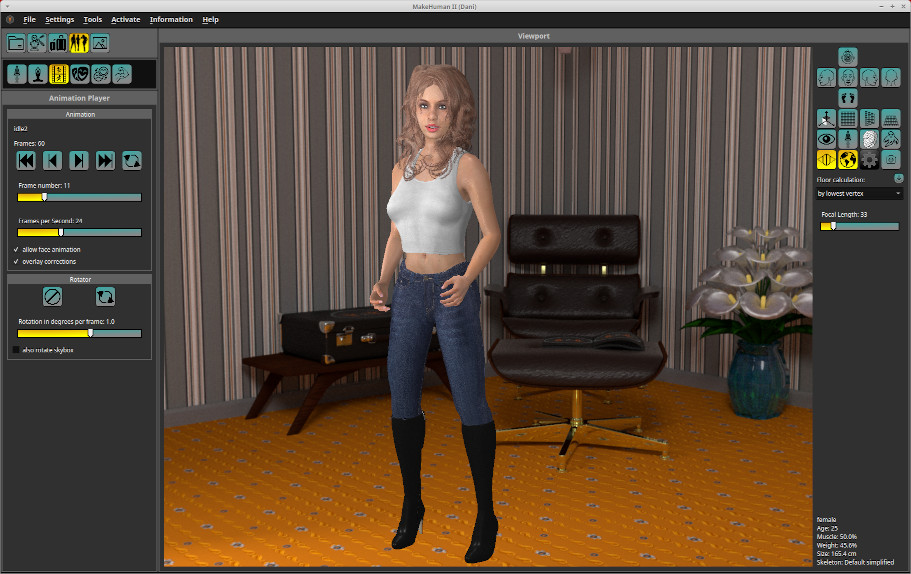

# MakeHuman II

<p align="center">
    
</p>


*Slowly the program becomes more stable and complete, but it is still under development and not yet officially released. If you need the official version, please work with MakeHuman version 1*

## Introduction

MakeHuman 2 should be successor of the standalone version MakeHuman 1, which has been running for more than 10 years. There will be additional features like working with additional base meshes, animation and PBR shading. For exports glTF standard will be supported. Some old standards will be no longer supported.

If you already want to test or work with this version, you should install it in parallel to old version.

Only Windows and Linux will be supported. The current stardard will be OpenGL still.

## Get the code

There are 2 methods to get the code, either with the git tools or simply download the zip file and unpack it where you want your code.

Cloning the repository with git on a cli works like this:

```
git clone https://github.com/makehumancommunity/makehuman2.git
```

Alternatively download the ZIP-File from github. In both cases there will be a directory called makehuman2 on your system.

If you want to update, either overwrite the folder with a new unzip or do

```
git pull
```

## Installation

You need to setup python and get some libraries.

For Linux you should install a virtual environment. The reason is, that Linux already has a python and libraries installed and in development stage it might be dangerous to overwrite the system environment.

### Linux only: build a virtual environment

Change to the newly created directory

```
cd makehuman2
```

Create a virtual environment (must be done once)

```
python3 -m venv venv
```

Activate the virtual environment (must be done always)

```
source venv/bin/activate
```
Your prompt should change to indicate the activated environment. 

### Windows only

Use the CLI and change to newly created directory, then type python3. If it is not available Windows normally offers to install that version. It should be from python.org (Python Software Foundation)

### Dependencies

For Windows and for Linux you now need to load the dependencies. 
**Caution Linux Users: Don't do this without activated environment. You might mess up your system!**

In the folder created there is a file requirements.txt. So by typing 

```
pip install -r requirements.txt
```

these dependencies will be installed.

```
The settings in requirements.txt are considered as minimal versions. Newer versions should(!) work.

* PyOpenGL (for the openGL part)
* PySide6 (for the gui)
* numpy (for faster calculation)
* psutil (for memory debugging, might not be in final version)
```

## First start and setup

You must start makehuman2 one time to specify your workspace folders. Although possible, do not mix program code and assets. This avoids downloading the assets again and again. The start is done with:


```
python3 makehuman.py
```

A window should open. Change the default folders inside Settings/Preferences where the assets should be installed.

Makehuman can work with two asset folders, one is called system folder, which is the place, where makehuman itself is installed and one is the user folder.

As an example: change MakeHuman user home to e.g. d:\shared\mhuser and logfile to d:\shared\mhuser\log (Windows syntax, Linux accordingly)

We do not recommend redirecting output of the logfile in this early stage. Since most people work with an hm08 mesh, select this as a your current base mesh.

When you exit Makehuman2 the preferences will be written to a configuration file which is used for all applications. It will even stay, when you re-install makehuman2.

## Additional assets

To work with makehuman you need to get the assets otherwise it would be pretty boring, this is done by:

```
python3 getpackages.py 
```

Choose "user space".

The program now does a download from MakeHuman fileserver (assets which are shared with MPFB2 and own assets like cubemaps and poses, floors and animations).
This might take some time.


## Optimizations

makehuman 2 can either work with ASCII or compiled targets. Compiled targets are much faster to load.
Also the meshes should be compiled (mhclo + obj will be compiled to mhbin) to work faster. Therefore you should use the following commands:


```
python3 compile_targets.py    # to compile system targets first.
python3 compile_meshes.py     # to compile meshes on both system + user folder. In system folder the base mesh itself is compiled.
```

**compile_targets** should be used to compile system targets first. 
**compile_meshes** should be used to compile meshes on both system + user folder. In system folder the base mesh itself is compiled.

You can also compile the meshes from  makehuman GUI, also the download can be done from there. Since system space is usually protected (esp. on Linux), a special option "-A" has to be used. Then you need to have the correct user permissions as well.

*New meshes (mostly clothes) in user folder will be compiled, when the mesh is used first time. New targets in user folder should be compiled via GUI from time to time.*

## Usual start

### Linux

When environment is already installed, you only need to do:

```
cd <path_to_your_makehuman2_folder>
source venv/bin/activate
python3 makehuman.py

# for developers: for not accidentally uploading the venv folder, you might put the venv folder somewhere else :)
```

### Windows:

It is possible to start MakeHuman2 the common way. An icon is supplied in the data/icons folder: makehuman2logo.ico. Make sure a suffix .py starts your python3 interpreter (mostly visual studio might be opened). Of course only do that, if you do not need visual studio ..


## Internals:

This installation will change for sure, since it is all under development.

Currently syntax is like this:

        usage: makehuman.py [-h] [-V] [--nomultisampling] [-l] [-b BASE] [-A] [-v VERBOSE] [model]

        positional arguments:
          model                 name of an mhm model file (use with base mesh

        optional arguments:
          -h, --help            show this help message and exit
          -V, --version         Show version and License
          --nomultisampling     disable multisampling (used to display multi transparent layers)
                                without multisampling normal blend function is used
          -l                    force to write to log file
          -b BASE, --base BASE  preselect base mesh use 'none' for no preselection
          -A, --admin           Support administrative tasks ('Admin'). Command will write into program folder, where makehuman is installed.
          -v VERBOSE, --verbose VERBOSE
                        bitwise verbose option (add values)
                        1 low log level (standard)
                        2 mid log level
                        4 memory management
                        8 file access
                        16 enable numpy runtime error messages
                        32 JSON for e.g glTF or to get lines for face or body poses when loading bvh file

*Hint: there is still output which do not follow the verbose rules for debugging.*

## Configuration file


The configuration file containing the path of the user folder can be changed also with an editor just in case.
It will keep in place, even when you delete the software.

To find this file simply display the version, it is presented in the last line:

	python3 makehuman -V

Do not wonder about the path for Windows, this is a special python sandbox to hold your %APPDATA%. Linux is more or less standard inside the .config folder.

##  Blender plugin

At the moment the blender plugin io_makehuman is already included in the software. It is in the folder extern / blender_addons.

zip this folder with either

zip -r io_makehuman.zip io_makehuman

on Linux or do that with a tool on Windows (when unzipped, the io_makehuman path must be created).

In Blender simply download the zip as a file. With key "n" it should appear on the side bar. The plugin can either load exported .mh2b files or use a socket for communication. The format is the same. The mh2b format is a combination of JSON and binary structure.

Best to Use this format for Blender because e.g. glTF will always convert everything to triangles.

## Further information

Further information you will find on the MakeHuman Community pages soon. Be aware that each screen has a context help.
